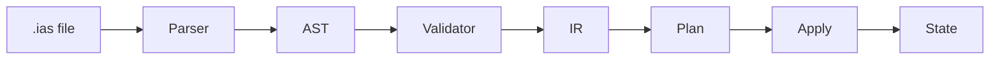

# Architecture Overview

This page describes the high-level architecture of the AgentSpec toolchain. It covers the full pipeline from parsing an IntentLang `.ias` file through to applying changes against a target platform.

## Pipeline

The AgentSpec CLI processes `.ias` files through a linear pipeline of stages. Each stage is implemented as a separate Go package under `internal/`.



**Stage breakdown:**

1. **Parse** -- The lexer tokenizes the `.ias` source. The recursive-descent parser produces an Abstract Syntax Tree (AST) with full source positions.
2. **Validate** -- Semantic checks run against the AST: duplicate names, unresolved references, type compatibility, and policy constraints.
3. **Lower to IR** -- The AST is lowered to an Intermediate Representation (IR). Resources are fully resolved, references are expanded, and each resource receives a SHA-256 content hash.
4. **Plan** -- The plan engine diffs the desired IR against the persisted state file (`.agentspec.state.json`). It produces a set of actions: `create`, `update`, `delete`, or `noop`.
5. **Apply** -- Actions are dispatched to the appropriate adapter (process, docker, compose, kubernetes). Results are written back to the state file.

## Package Index

| Package | Path | Responsibility |
|---------|------|----------------|
| `ast` | `internal/ast/` | AST node types and source positions |
| `parser` | `internal/parser/` | Lexer, tokenizer, and recursive-descent parser |
| `formatter` | `internal/formatter/` | Canonical formatting of `.ias` files |
| `validate` | `internal/validate/` | Semantic validation rules |
| `ir` | `internal/ir/` | Intermediate Representation types and canonical serialization |
| `plan` | `internal/plan/` | Desired-state diff engine |
| `apply` | `internal/apply/` | Action execution coordinator |
| `state` | `internal/state/` | State persistence backend (`.agentspec.state.json`) |
| `adapters` | `internal/adapters/` | Platform adapter interface and registry |
| `plugins` | `internal/plugins/` | WASM plugin host (wazero) |
| `runtime` | `internal/runtime/` | Agent runtime server and lifecycle |
| `loop` | `internal/loop/` | Agentic loop strategies (ReAct, etc.) |
| `llm` | `internal/llm/` | LLM client abstraction |
| `tools` | `internal/tools/` | Tool registry and executors (HTTP, command, inline) |
| `mcp` | `internal/mcp/` | Model Context Protocol client pool and discovery |
| `session` | `internal/session/` | Session management (in-memory, Redis) |
| `memory` | `internal/memory/` | Conversation memory strategies (sliding window, summary) |
| `secrets` | `internal/secrets/` | Secret resolution (env, vault, file) |
| `policy` | `internal/policy/` | Policy enforcement engine |
| `events` | `internal/events/` | Structured lifecycle events |
| `migrate` | `internal/migrate/` | Migration helpers (v1 to v2, path renames) |
| `pipeline` | `internal/pipeline/` | Multi-step pipeline execution |
| `templates` | `internal/templates/` | Go templates for code generation |
| `sdk/generator` | `internal/sdk/generator/` | SDK code generation (Python, TypeScript, Go) |
| `cli` | `internal/cli/` | CLI command wiring (cobra) |
| `telemetry` | `internal/telemetry/` | Telemetry collection and export |

## Data Flow

A typical `agentspec apply` invocation processes data through these stages:

```text
                    +------------------+
                    |   .ias source    |
                    +--------+---------+
                             |
                    +--------v---------+
                    |   Lexer/Parser   |  internal/parser
                    +--------+---------+
                             |
                    +--------v---------+
                    |       AST        |  internal/ast
                    +--------+---------+
                             |
               +-------------v--------------+
               |  Validator + Plugin Hooks   |  internal/validate, internal/plugins
               +-------------+--------------+
                             |
                    +--------v---------+
                    |    IR Document    |  internal/ir
                    +--------+---------+
                             |
          +------------------v------------------+
          |  Plan Engine (diff against state)   |  internal/plan, internal/state
          +------------------+------------------+
                             |
                    +--------v---------+
                    |  Action List     |
                    |  (create/update/ |
                    |   delete/noop)   |
                    +--------+---------+
                             |
              +--------------v--------------+
              |  Adapter (process, docker,  |  internal/adapters
              |  compose, kubernetes)       |
              +--------------+--------------+
                             |
                    +--------v---------+
                    |   State Update   |  .agentspec.state.json
                    +------------------+
```

The runtime pathway (`agentspec run`) follows a different branch after IR lowering: it builds a `RuntimeConfig` from the IR and starts the agent HTTP server with the agentic loop, MCP connections, and tool registry.

## Key Design Decisions

- **Deterministic output.** The IR serializer sorts resources and map keys to produce byte-identical JSON for the same logical input. This makes content hashing reliable for change detection.
- **Adapter abstraction.** The `Adapter` interface decouples the plan engine from any specific deployment target. Adding a new platform means implementing one interface.
- **WASM plugins.** Plugins run in a sandboxed WASM environment via wazero. They cannot access the host filesystem or network unless explicitly granted capabilities through the manifest.
- **State reconciliation.** The plan engine compares SHA-256 hashes of canonical resource JSON rather than doing field-by-field diffing. A hash mismatch triggers an update action.
