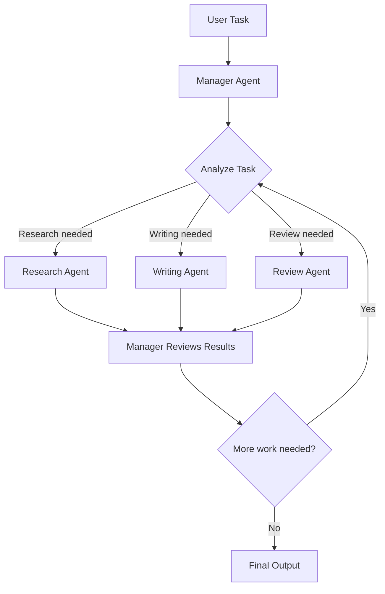

# Agent Delegation

## Problem

Complex projects often require multiple types of expertise: research, writing, design, review. A single agent trying to do everything produces mediocre results. But unlike a pipeline, the required specialists and their order are not known in advance -- they depend on the specific task at hand.

The **Agent Delegation** pattern solves this by introducing a manager agent that dynamically decomposes tasks and delegates subtasks to specialist agents based on what the work requires.

---

## How It Works

The Delegation pattern has a two-tier structure, similar to the Router pattern, but with a critical difference: the manager agent can invoke **multiple** specialists for a single request, and it actively coordinates their work.

1. **Manager Agent** -- Receives the task, analyzes what expertise is needed, and delegates subtasks to specialists.
2. **Specialist Agents** -- Domain-specific agents that handle individual subtasks and return results to the manager.
3. **Coordination** -- The manager reviews specialist outputs, decides if more work is needed, and synthesizes the final result.



Unlike the Router pattern (which selects exactly one specialist per request), the manager can invoke specialists sequentially or iteratively until the task is complete.

---

## IntentLang Configuration

The Delegation pattern uses multiple `delegate to agent ... when ...` rules on the manager agent:

<!-- novalidate -->
```ias
agent "project-manager" {
  uses prompt "manager"
  model "claude-sonnet-4-20250514"
  delegate to agent "research-agent" when "research is needed"
  delegate to agent "writing-agent" when "writing is needed"
  delegate to agent "review-agent" when "review is needed"
}
```

The manager's LLM evaluates the current state of the task against all `when` conditions and selects the appropriate delegate. After receiving the delegate's response, the manager can delegate again to a different (or the same) specialist.

---

## Complete Example

The following example defines a project management system where a manager agent coordinates research, writing, and review specialists to produce a deliverable.

```ias
package "delegation" version "0.1.0" lang "2.0"

prompt "manager" {
  content "You are a project manager agent. Break down complex tasks
and delegate them to specialist agents. Monitor progress
and coordinate between agents to ensure quality results."
}

prompt "researcher" {
  content "You are a research specialist. Gather information from
available sources and produce thorough, well-cited reports."
}

prompt "writer" {
  content "You are a writing specialist. Produce clear, well-structured
documents based on research findings and requirements."
}

prompt "reviewer" {
  content "You are a quality reviewer. Check documents for accuracy,
completeness, and clarity. Provide specific, actionable
feedback."
}

skill "search" {
  description "Search for information on a topic"
  input {
    topic string required
  }
  output {
    findings string
  }
  tool command {
    binary "search-tool"
  }
}

skill "write-doc" {
  description "Write a document section"
  input {
    topic string required
    findings string required
  }
  output {
    document string
  }
  tool command {
    binary "write-tool"
  }
}

skill "review-doc" {
  description "Review a document for quality"
  input {
    document string required
  }
  output {
    feedback string
  }
  tool command {
    binary "review-tool"
  }
}

agent "research-agent" {
  uses prompt "researcher"
  uses skill "search"
  model "claude-sonnet-4-20250514"
  strategy "react"
  max_turns 10
}

agent "writing-agent" {
  uses prompt "writer"
  uses skill "write-doc"
  model "claude-sonnet-4-20250514"
  max_turns 5
}

agent "review-agent" {
  uses prompt "reviewer"
  uses skill "review-doc"
  model "claude-sonnet-4-20250514"
  max_turns 5
}

agent "project-manager" {
  uses prompt "manager"
  model "claude-sonnet-4-20250514"
  delegate to agent "research-agent" when "research is needed"
  delegate to agent "writing-agent" when "writing is needed"
  delegate to agent "review-agent" when "review is needed"
}

deploy "local" target "process" {
  default true
  port 8080
}

deploy "production" target "kubernetes" {
  namespace "agents"
  replicas 2
}
```

!!! tip "Full example file"
    This example is available at [`docs/examples/delegation-agent.ias`](../../examples/delegation-agent.ias).

---

## Delegation Workflow Example

Here is a typical sequence of events when a user asks the project manager to "Write a technical report on WebAssembly performance":

1. **Manager** analyzes the task and decides research is needed first.
2. **Manager** delegates to `research-agent` with the topic.
3. **Research Agent** uses the `search` skill to gather information and returns findings.
4. **Manager** reviews the findings and decides writing is needed.
5. **Manager** delegates to `writing-agent` with the research findings.
6. **Writing Agent** produces a draft document.
7. **Manager** decides the draft needs review.
8. **Manager** delegates to `review-agent` with the draft.
9. **Review Agent** evaluates the document and returns feedback.
10. **Manager** may delegate back to `writing-agent` for revisions, or return the final document if the review is satisfactory.

This dynamic, iterative coordination is what distinguishes delegation from a fixed pipeline.

---

## When to Use

Delegation is the right choice when:

- The task requires **multiple types of expertise**, and the manager must coordinate their work.
- The **sequence of specialists** is not known in advance -- it depends on the specific task and intermediate results.
- The manager may need to **invoke the same specialist multiple times** (e.g., research, then write, then research more, then revise).
- You want **dynamic task decomposition** driven by the manager's reasoning about what the task requires.

## When Not to Use

Consider a different pattern when:

- The workflow is **fixed and predictable** -- use a [Pipeline](pipeline.md) to hardcode the step sequence. Pipelines are more efficient because they avoid the overhead of LLM-driven coordination.
- Only **one specialist** should handle any given request -- use the [Router](router.md) pattern. Delegation is overkill for simple classification and dispatch.
- The task is simple enough for a **single agent** -- use [ReAct](react.md) with the right set of skills.
- You need **parallel processing** -- delegation invokes one specialist at a time. Use [Map-Reduce](map-reduce.md) or a [Pipeline](pipeline.md) with parallel branches.

---

## Delegation vs. Router

Both patterns use the `delegate to agent` syntax, but they serve different purposes:

| Aspect | Delegation | Router |
|:-------|:-----------|:-------|
| **Intent** | Coordinate multiple specialists to complete a complex task | Classify a request and route it to one specialist |
| **Specialists invoked** | Multiple, potentially the same specialist more than once | Exactly one per request |
| **Manager role** | Active coordinator -- reviews results, decides next steps | Passive classifier -- dispatches and exits |
| **Iteration** | Manager may delegate multiple times in a loop | Single delegation, no follow-up |
| **Typical use** | Project coordination, research, complex deliverables | Customer support, help desk, intent-based routing |

---

## Delegation vs. Pipeline

| Aspect | Delegation | Pipeline |
|:-------|:-----------|:---------|
| **Control flow** | Dynamic, LLM-driven | Static, predefined |
| **Step order** | Determined at runtime by the manager | Declared in the pipeline definition |
| **Parallelism** | Sequential (one delegate at a time) | Parallel branches via `depends_on` |
| **Flexibility** | High -- the manager adapts to the task | Low -- every input follows the same path |
| **Overhead** | Higher -- the manager's LLM reasoning adds turns | Lower -- no coordination overhead |

!!! info "Choosing between Delegation and Pipeline"
    If you can write down the exact steps in advance, use a Pipeline. If the steps depend on the task and intermediate results, use Delegation.

---

## Trade-offs

| Dimension | Assessment |
|:----------|:-----------|
| **Latency** | Medium to High. Each delegation round trip includes the manager's reasoning plus the specialist's processing. Multiple delegation rounds add up. |
| **Accuracy** | High. The manager can review specialist outputs and request revisions. Multi-specialist coordination catches issues that a single agent would miss. |
| **Cost** | Higher than single-agent patterns. The manager consumes tokens for coordination, and each specialist consumes tokens for their work. |
| **Complexity** | Medium. Requires defining the manager, specialists, and clear `when` conditions. Simpler than a pipeline because there is no dependency graph to manage. |
| **Flexibility** | Highest of any multi-agent pattern. The manager dynamically adapts the workflow to the task at hand. |

---

## See Also

- [Router / Triage](router.md) -- Single-dispatch routing to one specialist
- [Multi-Agent Pipeline](pipeline.md) -- Fixed-step multi-agent workflows
- [Delegation Configuration](../configuration/delegation.md) -- Full `delegate` syntax reference
- [Agent Language Reference](../language/agent.md) -- Full agent block syntax
- [Deployment Overview](../deployment/index.md) -- Deploy your multi-agent system to Docker, Compose, or Kubernetes
