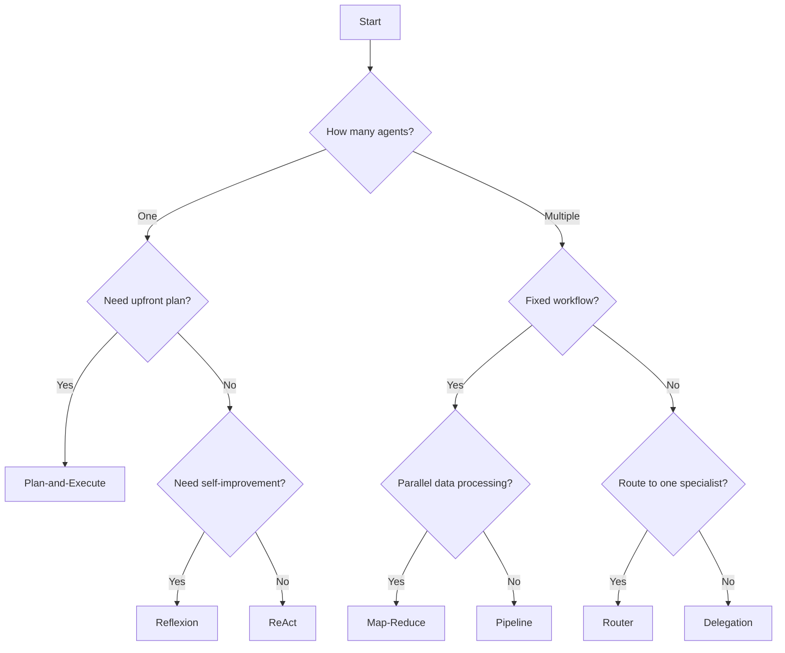

# Agentic Architecture Patterns

AgentSpec supports a range of agentic architecture patterns out of the box. Each pattern maps to a specific combination of IntentLang constructs -- strategies, delegation rules, and pipelines -- that encode a well-known approach to building AI agent systems.

This section provides detailed walkthroughs of each pattern: when to use it, how it works under the hood, and complete `.ias` examples you can adapt to your own use cases.

---

## Pattern Comparison

| Pattern | Strategy / Mechanism | Complexity | Latency | Best For |
|:--------|:---------------------|:-----------|:--------|:---------|
| [ReAct](react.md) | `strategy "react"` | Low | Medium | General-purpose reasoning with tool use |
| [Plan-and-Execute](plan-execute.md) | `strategy "plan-and-execute"` | Medium | High | Complex multi-step tasks requiring upfront planning |
| [Reflexion](reflexion.md) | `strategy "reflexion"` | Medium | High | Quality improvement through iterative self-critique |
| [Router / Triage](router.md) | `delegate to agent` | Medium | Low | Request classification and routing to specialists |
| [Map-Reduce](map-reduce.md) | `pipeline` (parallel steps) | High | Medium | Parallel data processing with aggregation |
| [Multi-Agent Pipeline](pipeline.md) | `pipeline` (sequential + parallel) | High | High | Deterministic multi-stage workflows |
| [Agent Delegation](delegation.md) | Multiple `delegate to agent` | Medium | Medium | Dynamic task decomposition with a manager agent |

---

## Choosing a Pattern

### Single-Agent Patterns

These patterns use a single agent with different execution strategies:

- **[ReAct](react.md)** -- The default workhorse. The agent observes the input, reasons about what to do, acts by calling a tool, and repeats. Best when you need flexible, tool-augmented reasoning and the task does not require upfront planning.

- **[Plan-and-Execute](plan-execute.md)** -- The agent creates a structured plan before executing any steps. Each step is verified before proceeding to the next. Best for complex tasks where getting the sequence right matters more than speed.

- **[Reflexion](reflexion.md)** -- The agent produces an initial output, critiques its own work, and revises. The loop continues until quality is satisfactory or the turn limit is reached. Best for content generation, code writing, and other tasks where iterative refinement improves quality.

### Multi-Agent Patterns

These patterns coordinate multiple agents working together:

- **[Router / Triage](router.md)** -- A coordinator agent classifies incoming requests and dispatches each one to the most appropriate specialist. Only one specialist handles any given request. Best for customer support, help desks, and any system that needs intent-based routing.

- **[Map-Reduce](map-reduce.md)** -- Multiple mapper agents process data chunks in parallel, then a reducer agent aggregates the results. Best for batch processing, large-scale analysis, and any workload that is embarrassingly parallel.

- **[Multi-Agent Pipeline](pipeline.md)** -- Agents execute in a defined sequence (or parallel branches) with explicit data dependencies between steps. Every input passes through the same stages. Best for code review, content moderation, ETL, and other workflows with fixed processing stages.

- **[Agent Delegation](delegation.md)** -- A manager agent dynamically delegates subtasks to specialist agents based on what the task requires. Unlike the router pattern, the manager may invoke multiple specialists for a single request. Best for project coordination, research tasks, and complex deliverables.

---

## Pattern Decision Tree

---

## What's Next?

Start with the pattern that best matches your use case, or read through each one to understand the full range of architectures AgentSpec supports:

1. [ReAct Agent](react.md) -- Observe, think, act
2. [Plan-and-Execute](plan-execute.md) -- Plan first, execute second
3. [Reflexion](reflexion.md) -- Draft, critique, revise
4. [Router / Triage](router.md) -- Classify and dispatch
5. [Map-Reduce](map-reduce.md) -- Parallel processing with aggregation
6. [Multi-Agent Pipeline](pipeline.md) -- Staged workflows
7. [Agent Delegation](delegation.md) -- Dynamic task decomposition
