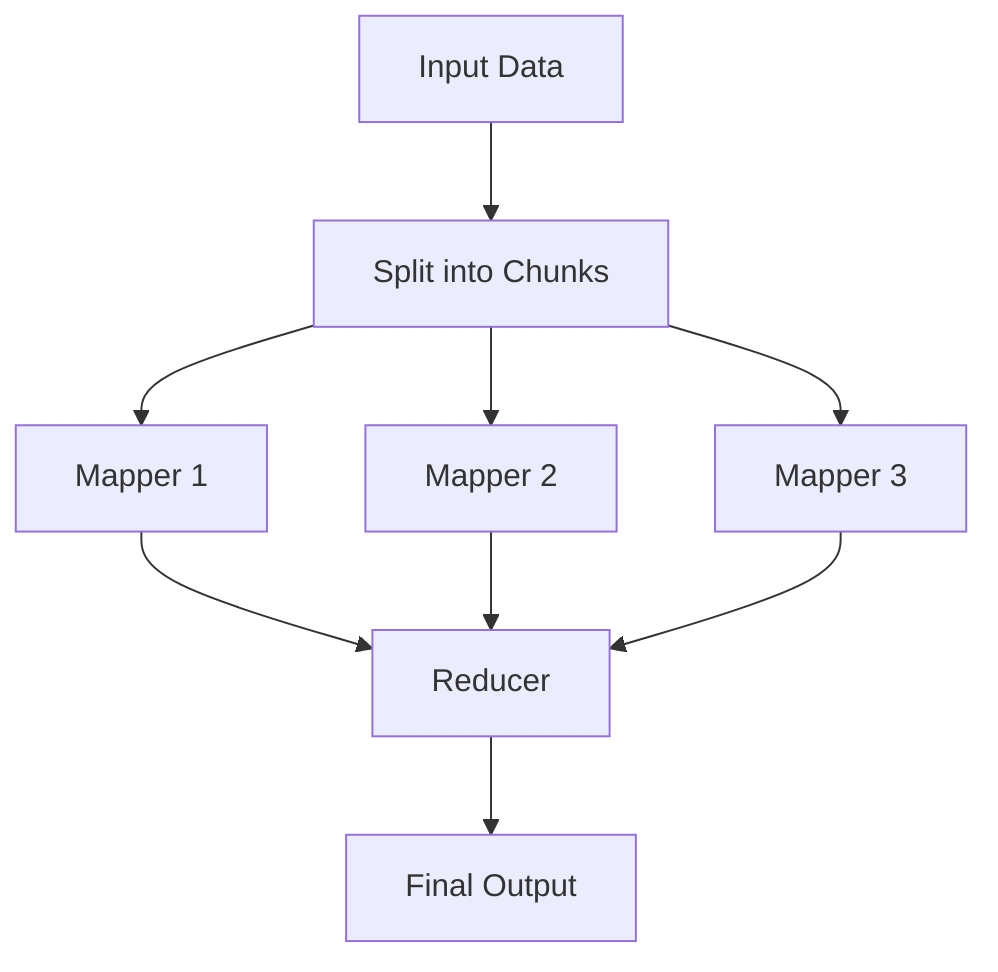

# Map-Reduce

## Problem

Some tasks involve processing large volumes of data that can be broken into independent chunks. Analyzing customer feedback, processing log files, summarizing multiple documents -- these workloads share a common structure: process each piece independently, then combine the results. Running them sequentially through a single agent is slow and wasteful.

The **Map-Reduce** pattern solves this by running multiple mapper agents in parallel (the "map" phase), then feeding all results into a single reducer agent that aggregates them (the "reduce" phase).

---

## How It Works

The Map-Reduce pattern has two phases:

1. **Map** -- Multiple instances of a mapper agent process independent data chunks concurrently. Each mapper produces a partial result.
2. **Reduce** -- A reducer agent receives all partial results and synthesizes them into a single, coherent output.



In IntentLang, this pattern is expressed as a `pipeline` where the map steps have no dependencies on each other (enabling parallel execution) and the reduce step uses `depends_on` to wait for all map steps to complete.

---

## IntentLang Configuration

The Map-Reduce pattern uses a `pipeline` block with parallel map steps and a dependent reduce step:

```ias
pipeline "map-reduce" {
  step "map-1" {
    agent "mapper"
    input "data chunk 1"
    output "analysis 1"
  }
  step "map-2" {
    agent "mapper"
    input "data chunk 2"
    output "analysis 2"
  }
  step "reduce" {
    agent "reducer"
    depends_on ["map-1", "map-2"]
    output "final summary"
  }
}
```

Steps without mutual `depends_on` relationships run in parallel automatically. The `reduce` step waits for all map steps to complete before it executes.

---

## Complete Example

The following example defines a data analysis system with three parallel mapper agents and one reducer that aggregates results.

```ias
package "map-reduce" version "0.1.0" lang "2.0"

prompt "mapper" {
  content "You are a data analysis specialist. Process individual
data chunks independently. Extract key insights, metrics,
and patterns from each chunk you receive."
}

prompt "reducer" {
  content "You are a synthesis specialist. Combine multiple analysis
results into a single coherent summary. Identify common
patterns, aggregate metrics, and highlight outliers across
all inputs."
}

skill "analyze-chunk" {
  description "Analyze a single chunk of data"
  input {
    chunk string required
  }
  output {
    analysis string
  }
  tool command {
    binary "chunk-analyzer"
  }
}

skill "merge-results" {
  description "Merge multiple analysis results into a summary"
  input {
    results string required
  }
  output {
    summary string
  }
  tool command {
    binary "result-merger"
  }
}

agent "mapper" {
  uses prompt "mapper"
  uses skill "analyze-chunk"
  model "claude-sonnet-4-20250514"
  max_turns 5
  timeout "30s"
}

agent "reducer" {
  uses prompt "reducer"
  uses skill "merge-results"
  model "claude-sonnet-4-20250514"
  max_turns 5
  timeout "60s"
}

pipeline "map-reduce" {
  step "map-1" {
    agent "mapper"
    input "data chunk 1"
    output "analysis 1"
  }
  step "map-2" {
    agent "mapper"
    input "data chunk 2"
    output "analysis 2"
  }
  step "map-3" {
    agent "mapper"
    input "data chunk 3"
    output "analysis 3"
  }
  step "reduce" {
    agent "reducer"
    depends_on ["map-1", "map-2", "map-3"]
    output "final summary"
  }
}

deploy "local" target "process" {
  default true
}
```

!!! tip "Full example file"
    This example is available at [`docs/examples/map-reduce-agent.ias`](../../examples/map-reduce-agent.ias).

---

## When to Use

Map-Reduce is the right choice when:

- The workload is **embarrassingly parallel** -- each data chunk can be processed independently without needing results from other chunks.
- You need to **reduce wall-clock time** -- parallel map steps complete in the time of the slowest mapper, not the sum of all mappers.
- The task involves **aggregation** -- processing individual items and then combining results (e.g., analyzing survey responses, summarizing document collections, extracting metrics from log files).
- **Data volume** is high enough that sequential processing would be unacceptably slow.

## When Not to Use

Consider a different pattern when:

- Steps have **data dependencies** -- if chunk 2 depends on the result of chunk 1, use a sequential [Pipeline](pipeline.md) instead.
- The task is a **single request** that does not decompose into independent chunks -- use [ReAct](react.md) or [Plan-and-Execute](plan-execute.md).
- You need **dynamic routing** based on content -- use the [Router](router.md) pattern.
- The number of chunks is **unknown at definition time** -- the pipeline steps are declared statically in IntentLang. For dynamic fan-out, consider building a controller agent that invokes mapper agents via delegation.

---

## Trade-offs

| Dimension | Assessment |
|:----------|:-----------|
| **Latency** | Medium. Map phase latency equals the slowest mapper (not the sum). Reduce phase adds one more processing step. |
| **Throughput** | High. Parallel execution processes N chunks in approximately the time of 1 chunk. |
| **Cost** | Higher than sequential processing. All mappers run simultaneously, consuming tokens in parallel. Total token usage is similar, but peak concurrency is higher. |
| **Complexity** | High. Requires defining mapper and reducer agents, structuring data into chunks, and managing the pipeline definition. |
| **Determinism** | High. The pipeline structure is fixed -- the same steps always run in the same pattern. Individual mapper outputs may vary due to LLM non-determinism. |

---

## Scaling Considerations

### Adding More Mappers

To process more data chunks, add more map steps to the pipeline and update the reduce step's `depends_on` list:

```ias
pipeline "large-map-reduce" {
  step "map-1" {
    agent "mapper"
    input "chunk 1"
    output "result 1"
  }
  step "map-2" {
    agent "mapper"
    input "chunk 2"
    output "result 2"
  }
  step "map-3" {
    agent "mapper"
    input "chunk 3"
    output "result 3"
  }
  step "map-4" {
    agent "mapper"
    input "chunk 4"
    output "result 4"
  }
  step "map-5" {
    agent "mapper"
    input "chunk 5"
    output "result 5"
  }
  step "reduce" {
    agent "reducer"
    depends_on ["map-1", "map-2", "map-3", "map-4", "map-5"]
    output "final summary"
  }
}
```

### Multi-Level Reduce

For very large data sets, you can introduce intermediate reduce steps to avoid overwhelming a single reducer:

```ias
pipeline "hierarchical-map-reduce" {
  step "map-1" { agent "mapper" input "chunk 1" output "r1" }
  step "map-2" { agent "mapper" input "chunk 2" output "r2" }
  step "map-3" { agent "mapper" input "chunk 3" output "r3" }
  step "map-4" { agent "mapper" input "chunk 4" output "r4" }
  step "partial-reduce-1" {
    agent "reducer"
    depends_on ["map-1", "map-2"]
    output "partial 1"
  }
  step "partial-reduce-2" {
    agent "reducer"
    depends_on ["map-3", "map-4"]
    output "partial 2"
  }
  step "final-reduce" {
    agent "reducer"
    depends_on ["partial-reduce-1", "partial-reduce-2"]
    output "final summary"
  }
}
```

---

## See Also

- [Pipeline Language Reference](../language/pipeline.md) -- Full pipeline block syntax
- [Multi-Agent Pipeline](pipeline.md) -- General multi-stage workflow pattern
- [Agent Language Reference](../language/agent.md) -- Full agent block syntax
- [ReAct Agent](react.md) -- Single-agent alternative for non-parallelizable tasks
- [Deployment Overview](../deployment/index.md) -- Deploy your pipeline to Docker, Compose, or Kubernetes
