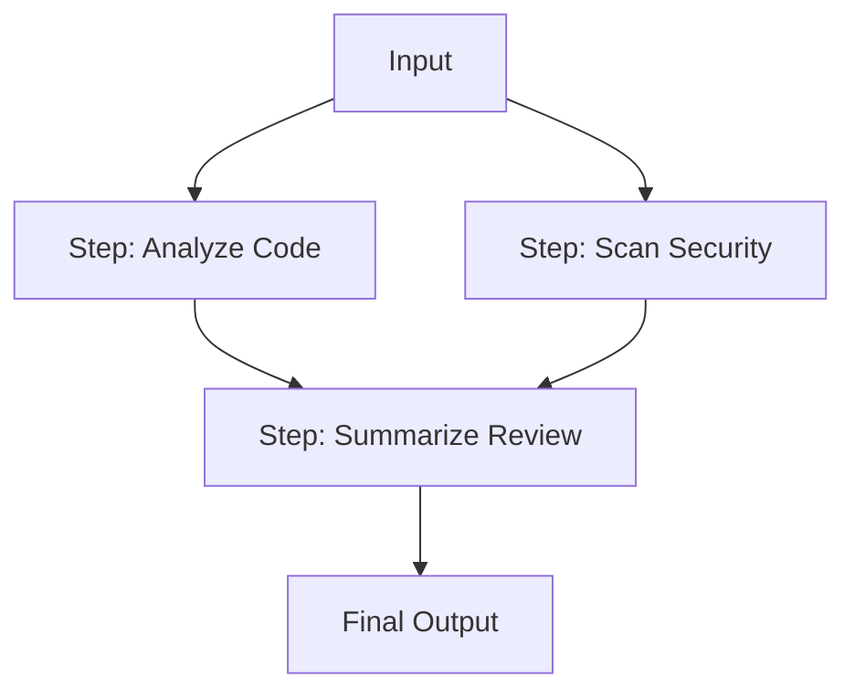
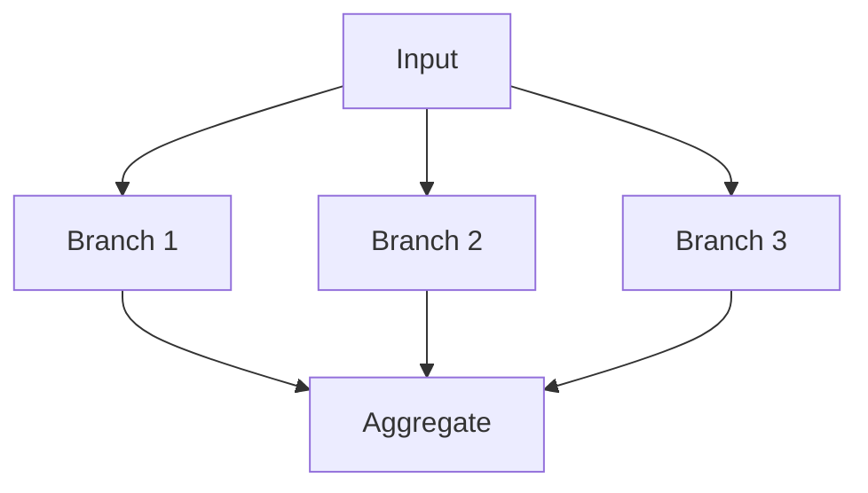
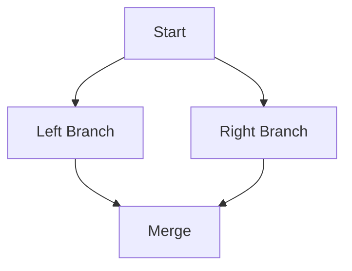

# Multi-Agent Pipeline

## Problem

Many real-world workflows require multiple agents with different expertise to process the same input through a series of stages. A code review needs static analysis, security scanning, and a final summary. A content moderation system needs toxicity detection, fact-checking, and editorial review. These stages have a fixed order, and later stages depend on the output of earlier ones.

The **Multi-Agent Pipeline** pattern defines a deterministic, multi-stage workflow where specialized agents execute in sequence (or in parallel branches) with explicit data dependencies.

---

## How It Works

A pipeline consists of named steps, each backed by an agent. Steps declare dependencies on other steps using `depends_on`, which controls execution order:

- Steps with **no dependencies** start immediately and can run in parallel.
- Steps with **dependencies** wait for all listed steps to complete before executing.
- The pipeline is complete when all steps have finished.



In this example, "Analyze Code" and "Scan Security" run in parallel (no mutual dependencies). "Summarize Review" waits for both to complete before producing the final output.

---

## IntentLang Configuration

Pipelines are declared using the `pipeline` block with nested `step` blocks:

```ias novalidate
pipeline "review" {
  step "analyze" {
    agent "code-analyzer"
    input "pull request URL"
    output "code analysis findings"
  }
  step "security" {
    agent "security-scanner"
    input "pull request URL"
    output "security findings"
  }
  step "summarize" {
    agent "review-summarizer"
    depends_on ["analyze", "security"]
    output "final review summary"
  }
}
```

Key attributes:

- **`agent`** -- The agent that executes this step.
- **`input`** -- A description of the input data for this step.
- **`output`** -- A name for the output produced by this step.
- **`depends_on`** -- A list of step names that must complete before this step starts.

---

## Complete Example

The following example defines a code review pipeline with parallel analysis and security scanning, followed by a summary step that combines all findings.

```ias
package "code-review" version "0.1.0" lang "2.0"

prompt "analyzer" {
  content "You are a code analysis expert. Identify code smells,
anti-patterns, and suggest improvements. Focus on
readability, maintainability, and performance."
}

prompt "security-reviewer" {
  content "You are a security expert. Scan code for vulnerabilities
including injection flaws, authentication issues, and
data exposure risks. Reference OWASP Top 10 where applicable."
}

prompt "summarizer" {
  content "You are a review summarizer. Combine analysis and security
findings into a concise, actionable review. Prioritize
issues by severity: critical, high, medium, low."
}

skill "read-diff" {
  description "Read a git diff or pull request"
  input {
    pr_url string required
  }
  output {
    diff string
  }
  tool command {
    binary "git-diff-reader"
  }
}

skill "analyze-code" {
  description "Run static analysis on code"
  input {
    code string required
  }
  output {
    findings string
  }
  tool command {
    binary "static-analyzer"
  }
}

skill "scan-security" {
  description "Scan code for security vulnerabilities"
  input {
    code string required
  }
  output {
    vulnerabilities string
  }
  tool command {
    binary "security-scanner"
  }
}

skill "post-review" {
  description "Post review comments to a pull request"
  input {
    pr_url string required
  }
  output {
    comment_id string
  }
  tool command {
    binary "pr-commenter"
  }
}

agent "code-analyzer" {
  uses prompt "analyzer"
  uses skill "read-diff"
  uses skill "analyze-code"
  model "claude-sonnet-4-20250514"
}

agent "security-scanner" {
  uses prompt "security-reviewer"
  uses skill "read-diff"
  uses skill "scan-security"
  model "claude-sonnet-4-20250514"
}

agent "review-summarizer" {
  uses prompt "summarizer"
  uses skill "post-review"
  model "claude-sonnet-4-20250514"
}

pipeline "code-review" {
  step "analyze" {
    agent "code-analyzer"
    input "pull request URL"
    output "code analysis findings"
  }
  step "security" {
    agent "security-scanner"
    input "pull request URL"
    output "security findings"
  }
  step "summarize" {
    agent "review-summarizer"
    depends_on ["analyze", "security"]
    output "final review summary"
  }
}

deploy "local" target "process" {
  default true
}

deploy "ci" target "docker-compose" {
}
```

!!! tip "Full example file"
    This example is available at [`docs/examples/code-review-pipeline.ias`](../../examples/code-review-pipeline.ias).

---

## Common Pipeline Shapes

### Sequential Chain

Every step depends on the previous one. No parallelism.


```ias novalidate
pipeline "sequential" {
  step "step-1" { agent "agent-a" output "result-1" }
  step "step-2" { agent "agent-b" depends_on ["step-1"] output "result-2" }
  step "step-3" { agent "agent-c" depends_on ["step-2"] output "result-3" }
}
```

### Fan-Out / Fan-In

Multiple steps run in parallel, then converge at a single aggregation step.



```ias novalidate
pipeline "fan-out-fan-in" {
  step "branch-1" { agent "agent-a" output "result-1" }
  step "branch-2" { agent "agent-b" output "result-2" }
  step "branch-3" { agent "agent-c" output "result-3" }
  step "aggregate" {
    agent "agent-d"
    depends_on ["branch-1", "branch-2", "branch-3"]
    output "combined"
  }
}
```

### Diamond

A step fans out to two branches, which reconverge at a single step.



```ias novalidate
pipeline "diamond" {
  step "start" { agent "splitter" output "split-data" }
  step "left" { agent "processor-a" depends_on ["start"] output "left-result" }
  step "right" { agent "processor-b" depends_on ["start"] output "right-result" }
  step "merge" {
    agent "combiner"
    depends_on ["left", "right"]
    output "merged-result"
  }
}
```

---

## When to Use

The Pipeline pattern is the right choice when:

- The workflow has **fixed, known stages** that every input must pass through.
- Steps have **explicit data dependencies** -- some stages cannot start until others finish.
- You want **deterministic execution** -- the same pipeline always runs the same steps in the same order.
- Multiple agents with **different specializations** need to process the same input.
- You need **parallel branches** to reduce total processing time.

## When Not to Use

Consider a different pattern when:

- The workflow is **dynamic** -- the set of steps depends on the input content. Use [Delegation](delegation.md) for LLM-driven task decomposition.
- Only **one specialist** should handle any given request -- use the [Router](router.md) pattern instead.
- The task is simple enough for a **single agent** -- use [ReAct](react.md) or [Plan-and-Execute](plan-execute.md).
- You need **purely parallel, homogeneous processing** -- use [Map-Reduce](map-reduce.md) for the fan-out/fan-in of identical work.

---

## Trade-offs

| Dimension | Assessment |
|:----------|:-----------|
| **Latency** | Medium to High. Depends on the pipeline shape. Parallel branches reduce latency compared to pure sequential execution. The critical path determines total time. |
| **Accuracy** | High. Each agent is a specialist focused on one aspect. Multiple perspectives reduce the chance of missed issues. |
| **Cost** | Proportional to the number of steps. Each step invokes an agent, consuming tokens and possibly tool calls. |
| **Complexity** | High. Requires defining multiple agents, their skills, and the pipeline's dependency graph. |
| **Determinism** | High. The pipeline structure is fixed -- the same steps always execute in the same order. Individual agent outputs may vary due to LLM non-determinism. |

---

## Pipeline vs. Delegation

| Aspect | Pipeline | Delegation |
|:-------|:---------|:-----------|
| **Control flow** | Static, predefined step sequence | Dynamic, LLM-driven routing |
| **Execution** | All steps always execute | One or more delegates selected per request |
| **Use case** | Fixed multi-stage workflows | Request classification and task decomposition |
| **Parallelism** | Explicit via `depends_on` | One delegate at a time |
| **Data flow** | Each step receives output from dependencies | Original request forwarded to delegate |

---

## See Also

- [Pipeline Language Reference](../language/pipeline.md) -- Full pipeline block syntax
- [Map-Reduce](map-reduce.md) -- Specialized parallel processing pattern
- [Agent Delegation](delegation.md) -- Dynamic multi-agent coordination
- [Agent Language Reference](../language/agent.md) -- Full agent block syntax
- [Deployment Overview](../deployment/index.md) -- Deploy your pipeline to Docker, Compose, or Kubernetes
