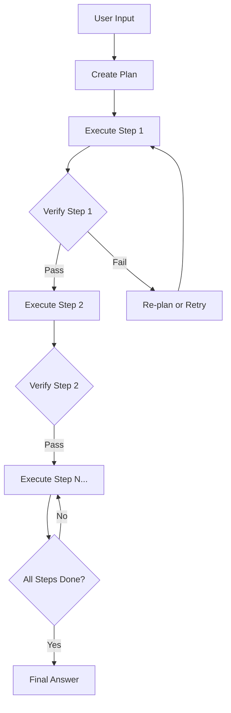

# Plan-and-Execute

## Problem

Some tasks are too complex for a simple observe-think-act loop. When a task involves multiple dependent steps, getting the sequence wrong can waste time, consume tokens, or produce incorrect results. The agent needs to think ahead before taking any action.

The **Plan-and-Execute** pattern solves this by separating planning from execution. The agent first creates a structured plan, then executes each step in order, verifying results along the way.

---

## How It Works

The Plan-and-Execute strategy operates in three distinct phases:

1. **Plan** -- The agent analyzes the task and produces a numbered, step-by-step plan.
2. **Execute** -- The agent works through each step sequentially, invoking tools as needed.
3. **Verify** -- After each step, the agent checks whether the result matches expectations before proceeding.



If verification fails, the agent can re-plan the remaining steps or retry the failed step, depending on the nature of the failure.

---

## IntentLang Configuration

Enable the Plan-and-Execute pattern by setting `strategy "plan-and-execute"` on an agent:

```ias
agent "planner" {
  strategy "plan-and-execute"
  max_turns 20
  timeout "120s"
}
```

The higher `max_turns` and `timeout` values reflect the fact that planning adds overhead compared to a simple ReAct loop. Each plan step, execution, and verification consumes turns.

---

## Complete Example

The following example defines a planning assistant that breaks tasks into steps, executes them, and verifies results.

```ias
package "plan-execute" version "0.1.0" lang "2.0"

prompt "planner" {
  content "You are a planning assistant. Break complex tasks into
step-by-step plans. Each step should be actionable and
verifiable. Output your plan as a numbered list before
executing any steps."
}

skill "create-plan" {
  description "Create a structured execution plan from a task description"
  input {
    task string required
  }
  output {
    plan string
  }
  tool command {
    binary "plan-tool"
  }
}

skill "execute-step" {
  description "Execute a single step from the plan"
  input {
    step string required
  }
  output {
    result string
  }
  tool command {
    binary "execute-tool"
  }
}

skill "verify-result" {
  description "Verify the result of an executed step"
  input {
    expected string required
    actual string required
  }
  output {
    verification string
  }
  tool command {
    binary "verify-tool"
  }
}

agent "planner" {
  uses prompt "planner"
  uses skill "create-plan"
  uses skill "execute-step"
  uses skill "verify-result"
  model "claude-sonnet-4-20250514"
  strategy "plan-and-execute"
  max_turns 20
  timeout "120s"
  token_budget 300000
  on_error "retry"
  max_retries 2
}

deploy "local" target "process" {
  default true
}
```

!!! tip "Full example file"
    This example is available at [`docs/examples/plan-execute-agent.ias`](../../examples/plan-execute-agent.ias).

---

## When to Use

Plan-and-Execute is the right choice when:

- The task has **multiple dependent steps** that must execute in the correct order.
- **Getting it right the first time** matters more than speed -- for example, database migrations, infrastructure provisioning, or multi-stage data transformations.
- The task benefits from **upfront reasoning** about what needs to happen before any action is taken.
- You want **verifiable intermediate results** -- each step produces an output that can be checked.

## When Not to Use

Consider a different pattern when:

- The task is **simple or open-ended** -- a [ReAct](react.md) agent can handle it without the planning overhead.
- **Speed** is the primary concern -- the planning phase adds latency before any real work begins.
- The steps are **already known and fixed** -- use a [Pipeline](pipeline.md) to hardcode the sequence instead of having the LLM re-derive it every time.
- The task requires **parallel processing** -- Plan-and-Execute is inherently sequential. Use [Map-Reduce](map-reduce.md) for concurrent workloads.

---

## Trade-offs

| Dimension | Assessment |
|:----------|:-----------|
| **Latency** | High. The planning phase adds 1-3 turns of overhead before execution begins. Total latency scales with the number of plan steps. |
| **Accuracy** | High. Upfront planning reduces wasted steps. Verification catches errors early. |
| **Cost** | Higher than ReAct due to the additional planning and verification turns. Set `token_budget` to cap total spend. |
| **Complexity** | Medium. Requires skills for planning, execution, and verification. |
| **Determinism** | Medium. The plan itself is LLM-generated, but once created, execution follows the plan sequentially. |

---

## Tuning Tips

- **Set `max_turns` to at least 2x the expected number of plan steps** to account for the planning phase and verification overhead.
- **Use a longer `timeout`** (90-120s) since multi-step execution takes more wall-clock time.
- **Prompt the agent to produce numbered plans.** Structured plans are easier for the agent to follow and for you to debug.
- **Include a verification skill.** Without explicit verification, the agent may proceed past failed steps.

---

## See Also

- [ReAct Agent](react.md) -- Simpler alternative for tasks that do not need upfront planning
- [Pipeline](pipeline.md) -- Fixed-step alternative when the sequence is known in advance
- [Agent Language Reference](../language/agent.md) -- Full agent block syntax
- [Agent Runtime Configuration](../configuration/runtime.md) -- Strategy, model, and runtime attributes
- [Deployment Overview](../deployment/index.md) -- Deploy your agent to Docker, Compose, or Kubernetes
