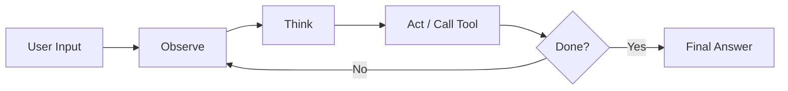

# ReAct Agent

## Problem

Many tasks require an agent to reason about a situation and take action using external tools -- searching the web, querying a database, calling an API -- in an iterative loop. The agent needs to observe results, think about what to do next, and act again until the task is complete.

The **ReAct** (Reasoning + Acting) pattern solves this by interleaving reasoning traces with tool invocations in a tight loop.

---

## How It Works

The ReAct loop has three phases that repeat until the agent produces a final answer or reaches its turn limit:

1. **Observe** -- The agent receives the user's question or the result of a previous tool call.
2. **Think** -- The agent reasons about what information is missing and which tool to use.
3. **Act** -- The agent invokes a tool and receives the result, which becomes the next observation.



Each iteration consumes one "turn" against the agent's `max_turns` budget.

---

## IntentLang Configuration

In IntentLang, you enable the ReAct pattern by setting `strategy "react"` on an agent:

```ias novalidate
agent "my-agent" {
  strategy "react"
  max_turns 15
}
```

The `strategy "react"` directive tells the AgentSpec runtime to use the observe-think-act execution loop. The `max_turns` attribute caps the number of iterations to prevent runaway loops.

---

## Complete Example

The following example defines a research assistant that uses web search, summarization, and fact-checking tools in a ReAct loop.

```ias
package "react-agent" version "0.1.0" lang "2.0"

prompt "researcher" {
  content "You are a research assistant. Use available tools to
gather information, analyze findings, and synthesize
clear answers. Think step by step: observe the question,
reason about what tools to use, and act accordingly."
}

skill "web-search" {
  description "Search the web for information"
  input {
    query string required
  }
  output {
    results string
  }
  tool command {
    binary "search-tool"
  }
}

skill "summarize" {
  description "Summarize a body of text"
  input {
    text string required
  }
  output {
    summary string
  }
  tool command {
    binary "summarize-tool"
  }
}

skill "fact-check" {
  description "Verify a claim against known sources"
  input {
    claim string required
  }
  output {
    verification string
  }
  tool command {
    binary "fact-check-tool"
  }
}

agent "researcher" {
  uses prompt "researcher"
  uses skill "web-search"
  uses skill "summarize"
  uses skill "fact-check"
  model "claude-sonnet-4-20250514"
  strategy "react"
  max_turns 15
  timeout "60s"
  token_budget 200000
  stream true
  on_error "retry"
  max_retries 3
}

deploy "local" target "process" {
  default true
  port 8080
  health {
    path "/healthz"
  }
}
```

!!! tip "Full example file"
    This example is available at [`docs/examples/react-agent.ias`](../../examples/react-agent.ias).

---

## When to Use

ReAct is the right choice when:

- The task requires **dynamic tool selection** -- the agent must decide which tool to call based on intermediate results.
- You need **flexible reasoning** -- the agent does not know the full sequence of steps in advance.
- The workload is **interactive** -- the agent responds to a single user request with one or more tool calls.
- You want the **simplest multi-turn agent** -- ReAct has the lowest configuration overhead of any strategy.

## When Not to Use

Consider a different pattern when:

- The task has a **known, fixed sequence of steps** -- use [Plan-and-Execute](plan-execute.md) or a [Pipeline](pipeline.md) instead.
- **Output quality** matters more than speed -- [Reflexion](reflexion.md) adds a self-critique loop that catches errors ReAct would miss.
- You need to **route requests to specialists** -- use the [Router](router.md) pattern to classify and dispatch.
- The workload is **embarrassingly parallel** -- use [Map-Reduce](map-reduce.md) to process data chunks concurrently.

---

## Trade-offs

| Dimension | Assessment |
|:----------|:-----------|
| **Latency** | Medium. Each think-act cycle adds a round trip to the LLM and possibly an external tool. Typical tasks complete in 3-8 turns. |
| **Accuracy** | Good for factual tasks. The agent can self-correct by searching for more information. However, it lacks the explicit critique step of Reflexion. |
| **Cost** | Proportional to the number of turns. Set `max_turns` and `token_budget` to cap spend. |
| **Complexity** | Low. A single agent, a prompt, and one or more skills is all you need. |
| **Determinism** | Low. The agent chooses tools dynamically, so the same input may produce different tool-call sequences. |

---

## Tuning Tips

- **Start with `max_turns 10`** and increase only if you observe the agent running out of turns on legitimate tasks.
- **Set a `timeout`** to prevent long-running tool calls from stalling the loop.
- **Use `on_error "retry"` with `max_retries 2-3`** for tools that may experience transient failures (network calls, rate limits).
- **Keep prompts focused.** A clear, specific prompt reduces wasted turns where the agent reasons about irrelevant tools.

---

## Deployment

A minimal deployment configuration for a ReAct agent:

```ias novalidate
deploy "production" target "kubernetes" {
  namespace "agents"
  replicas 2
}
```

For local development, the `target "process"` deployment runs the agent as a standalone process on your machine.

---

## See Also

- [Agent Language Reference](../language/agent.md) -- Full agent block syntax
- [Skill Language Reference](../language/skill.md) -- Defining skills and tools
- [Agent Runtime Configuration](../configuration/runtime.md) -- Strategy, model, and runtime attributes
- [Error Handling](../configuration/error-handling.md) -- Retry and fallback strategies
- [Deployment Overview](../deployment/index.md) -- Deploy your agent to Docker, Compose, or Kubernetes
