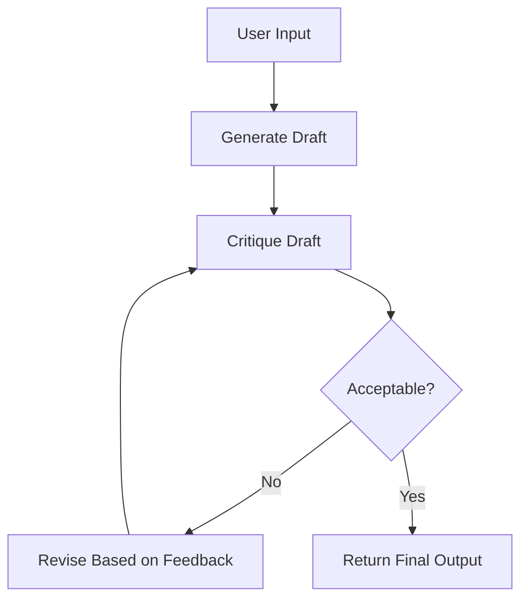

# Reflexion

## Problem

First drafts are rarely the best drafts. Whether the task is writing code, producing a report, or generating marketing copy, the initial output often contains gaps, inaccuracies, or stylistic issues. A human would review their work and revise it -- an agent can do the same.

The **Reflexion** pattern enables an agent to iteratively improve its output through a cycle of drafting, self-critique, and revision.

---

## How It Works

The Reflexion strategy operates in a loop with three phases:

1. **Draft** -- The agent produces an initial output.
2. **Critique** -- The agent (or a dedicated critique tool) evaluates the draft, identifying weaknesses, missing information, factual errors, and areas for improvement.
3. **Revise** -- The agent incorporates the feedback and produces an improved version.

The loop repeats until the critique finds no significant issues or the agent exhausts its turn budget.



Each cycle through the loop typically consumes 2-3 turns (critique + revision), so an agent with `max_turns 10` can perform 3-4 revision cycles.

---

## IntentLang Configuration

Enable the Reflexion pattern by setting `strategy "reflexion"` on an agent:

```ias
agent "writer" {
  strategy "reflexion"
  max_turns 10
  timeout "90s"
}
```

The `strategy "reflexion"` directive tells the runtime to use the draft-critique-revise execution loop instead of the default observe-think-act loop.

---

## Complete Example

The following example defines a writing assistant that drafts text, critiques its own work, and revises until quality is satisfactory.

```ias
package "reflexion" version "0.1.0" lang "2.0"

prompt "writer" {
  content "You are a writing assistant that produces high-quality text.
After each draft, reflect on your work: identify weaknesses,
missing information, and areas for improvement. Then revise
your output based on your self-critique."
}

skill "draft" {
  description "Generate an initial draft of text"
  input {
    topic string required
    requirements string required
  }
  output {
    draft string
  }
  tool command {
    binary "draft-tool"
  }
}

skill "critique" {
  description "Critically evaluate a piece of text"
  input {
    text string required
  }
  output {
    feedback string
  }
  tool command {
    binary "critique-tool"
  }
}

skill "revise" {
  description "Revise text based on feedback"
  input {
    text string required
    feedback string required
  }
  output {
    revised string
  }
  tool command {
    binary "revise-tool"
  }
}

agent "reflective-writer" {
  uses prompt "writer"
  uses skill "draft"
  uses skill "critique"
  uses skill "revise"
  model "claude-sonnet-4-20250514"
  strategy "reflexion"
  max_turns 10
  timeout "90s"
  token_budget 250000
  on_error "retry"
  max_retries 2
}

deploy "local" target "process" {
  default true
}
```

!!! tip "Full example file"
    This example is available at [`docs/examples/reflexion-agent.ias`](../../examples/reflexion-agent.ias).

---

## When to Use

Reflexion is the right choice when:

- **Output quality** is more important than speed -- the extra revision cycles catch errors and improve clarity.
- The task involves **content generation** -- writing, code generation, report creation, or any task where iterative refinement helps.
- You want the agent to **self-correct** without external human feedback.
- The task has **clear quality criteria** that the agent can evaluate (correctness, completeness, style).

## When Not to Use

Consider a different pattern when:

- **Speed** is critical -- each revision cycle adds latency. Use [ReAct](react.md) for fast, single-pass responses.
- The task is **factual lookup** -- Reflexion adds unnecessary overhead when the answer is either right or wrong. ReAct with a fact-checking tool is more efficient.
- The task requires **multiple agents** -- Reflexion is a single-agent pattern. Use [Delegation](delegation.md) or a [Pipeline](pipeline.md) to coordinate multiple specialists.
- The quality criteria are **ambiguous** -- if the agent cannot evaluate its own output meaningfully, the critique step wastes turns without improving quality.

---

## Trade-offs

| Dimension | Assessment |
|:----------|:-----------|
| **Latency** | High. Each revision cycle adds 2-3 LLM round trips. A 3-cycle Reflexion loop takes roughly 3x the time of a single ReAct pass. |
| **Accuracy** | High. Self-critique catches errors, omissions, and inconsistencies that a single pass would miss. |
| **Cost** | Higher than ReAct. Each critique and revision turn consumes tokens. Use `max_turns` and `token_budget` to set upper bounds. |
| **Complexity** | Medium. Requires drafting, critique, and revision skills (or relies on the model's built-in ability to self-critique). |
| **Output Quality** | Highest of any single-agent pattern. The iterative improvement loop consistently produces better final outputs. |

---

## Tuning Tips

- **Set `max_turns` to 3x your desired revision count.** Each cycle uses approximately 3 turns (draft/critique/revise). For 3 revision cycles, set `max_turns 10`.
- **Make critique criteria explicit in the prompt.** Tell the agent what to look for: factual accuracy, completeness, tone, structure.
- **Use a dedicated critique tool** for objective evaluation (e.g., a linter for code, a grammar checker for text) rather than relying solely on the model's self-assessment.
- **Monitor revision quality.** If the agent's revisions stop improving after 2 cycles, consider lowering `max_turns` to save cost.

---

## See Also

- [ReAct Agent](react.md) -- Simpler, faster alternative without the self-critique loop
- [Plan-and-Execute](plan-execute.md) -- Alternative for tasks that need upfront planning rather than iterative refinement
- [Agent Language Reference](../language/agent.md) -- Full agent block syntax
- [Agent Runtime Configuration](../configuration/runtime.md) -- Strategy, model, and runtime attributes
- [Deployment Overview](../deployment/index.md) -- Deploy your agent to Docker, Compose, or Kubernetes
