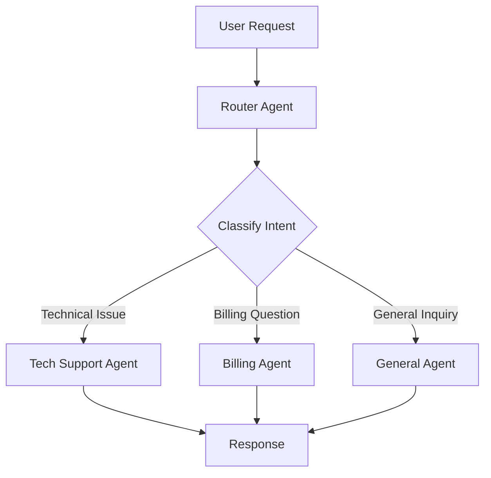

# Router / Triage

## Problem

Many systems need to handle a wide variety of user requests, each requiring different expertise. A billing question needs a billing specialist. A technical issue needs a tech support agent. A single general-purpose agent would need to be an expert in everything, leading to bloated prompts, confused reasoning, and poor performance.

The **Router** (or Triage) pattern solves this by introducing a lightweight coordinator agent that classifies incoming requests and dispatches each one to the most appropriate specialist.

---

## How It Works

The Router pattern has a simple two-tier structure:

1. **Router Agent** -- Receives the user's request, analyzes its intent, and selects the best specialist.
2. **Specialist Agents** -- Domain-specific agents, each with their own prompt, skills, and model configuration. Only one specialist handles any given request.



The router agent does not process the request itself. It reads the `when` conditions on its `delegate` rules and selects the best match using LLM-driven classification.

---

## IntentLang Configuration

The Router pattern uses the `delegate to agent ... when ...` syntax inside the router agent's block:

```ias
agent "router" {
  uses prompt "triage"
  model "claude-sonnet-4-20250514"
  delegate to agent "tech-agent" when "user has a technical issue"
  delegate to agent "billing-agent" when "user has a billing question"
  delegate to agent "general-agent" when "user has a general inquiry"
}
```

Each `delegate` rule specifies:

- **`to agent`** -- The target specialist agent (must be defined in the same package).
- **`when`** -- A natural-language condition describing when to route to that specialist.

The router's LLM evaluates all conditions against the incoming request and picks the best match.

---

## Complete Example

The following example defines a customer support system with a triage router that dispatches requests to tech support, billing, or general assistance.

```ias
package "router-agent" version "0.1.0" lang "2.0"

prompt "triage" {
  content "You are a request router. Analyze the user's request and
delegate it to the most appropriate specialist agent.
Consider the topic, complexity, and required expertise
when making routing decisions."
}

prompt "tech-support" {
  content "You are a technical support specialist. Help users
resolve technical issues with software and hardware.
Ask clarifying questions when needed."
}

prompt "billing" {
  content "You are a billing specialist. Help users with
invoices, payments, refunds, and subscription management.
Always verify account details before making changes."
}

prompt "general" {
  content "You are a general assistant. Handle inquiries that
do not require specialized expertise. Be helpful and
direct the user to specialists if needed."
}

skill "lookup-account" {
  description "Look up a customer account by email or ID"
  input {
    identifier string required
  }
  output {
    account string
  }
  tool command {
    binary "account-lookup"
  }
}

skill "check-system-status" {
  description "Check the status of internal systems and services"
  input {
    service string required
  }
  output {
    status string
  }
  tool command {
    binary "status-check"
  }
}

skill "process-refund" {
  description "Process a customer refund"
  input {
    order_id string required
    reason string required
  }
  output {
    refund_id string
  }
  tool command {
    binary "refund-tool"
  }
}

agent "tech-agent" {
  uses prompt "tech-support"
  uses skill "check-system-status"
  model "claude-sonnet-4-20250514"
  strategy "react"
  max_turns 10
}

agent "billing-agent" {
  uses prompt "billing"
  uses skill "lookup-account"
  uses skill "process-refund"
  model "claude-sonnet-4-20250514"
  strategy "react"
  max_turns 10
}

agent "general-agent" {
  uses prompt "general"
  model "claude-sonnet-4-20250514"
  max_turns 5
}

agent "router" {
  uses prompt "triage"
  model "claude-sonnet-4-20250514"
  delegate to agent "tech-agent" when "user has a technical issue"
  delegate to agent "billing-agent" when "user has a billing question"
  delegate to agent "general-agent" when "user has a general inquiry"
}

deploy "local" target "process" {
  default true
  port 8080
}
```

!!! tip "Full example file"
    This example is available at [`docs/examples/router-agent.ias`](../../examples/router-agent.ias).

---

## When to Use

The Router pattern is the right choice when:

- You need **intent-based request routing** -- different types of requests require different handling.
- Each request should be handled by **exactly one specialist** -- there is no need for multiple agents to collaborate on a single request.
- You want **separation of concerns** -- each specialist has a focused prompt and a narrow set of skills, making agents easier to develop, test, and maintain.
- **Low latency** matters -- the router adds only one LLM call for classification before handing off to the specialist.

## When Not to Use

Consider a different pattern when:

- A single request requires **multiple agents to collaborate** -- use [Delegation](delegation.md) for dynamic multi-agent coordination or a [Pipeline](pipeline.md) for fixed multi-stage processing.
- The workflow is **always the same regardless of input** -- use a [Pipeline](pipeline.md) instead of routing.
- You need **parallel processing** of the same input -- use [Map-Reduce](map-reduce.md).
- The task is simple enough for a **single agent** -- use [ReAct](react.md) without the routing overhead.

---

## Trade-offs

| Dimension | Assessment |
|:----------|:-----------|
| **Latency** | Low. The router adds one LLM classification call (typically fast) before dispatching to the specialist. Total latency is roughly: classification + specialist processing. |
| **Accuracy** | Depends on condition clarity. Well-written, distinct `when` conditions yield reliable routing. Overlapping conditions cause misroutes. |
| **Cost** | Moderate. One additional LLM call for routing, plus the specialist's calls. The router call is typically short and cheap. |
| **Complexity** | Medium. Requires defining multiple agents and writing clear routing conditions. |
| **Scalability** | High. Adding a new specialist is as simple as defining a new agent and adding a `delegate` rule. |

---

## Writing Good Routing Conditions

The `when` conditions are natural-language descriptions interpreted by the router's LLM. Follow these guidelines:

- **Be specific.** Describe the type of request, not the action. `"user reports a bug or needs help with software"` is better than `"user needs help"`.
- **Avoid overlap.** If two conditions are too similar, the router may make inconsistent decisions. Test with edge cases.
- **Cover the full space.** Include a catch-all specialist (like `"general-agent"`) for requests that do not match any specific category.

```ias
# Good: specific, non-overlapping conditions
delegate to agent "tech-agent" when "user reports a bug or needs help with software"
delegate to agent "billing-agent" when "user asks about invoices, payments, or subscriptions"
delegate to agent "general-agent" when "user has a general question or the request does not fit other categories"
```

!!! warning "Test your routing"
    Always test routing with a diverse set of sample inputs. Ambiguous conditions are the most common source of errors in router-based systems.

---

## See Also

- [Agent Delegation](delegation.md) -- Dynamic multi-agent coordination (manager delegates to multiple specialists)
- [Delegation Configuration](../configuration/delegation.md) -- Full `delegate` syntax reference
- [Agent Language Reference](../language/agent.md) -- Full agent block syntax
- [Pipeline](pipeline.md) -- Fixed-step alternative for multi-stage workflows
- [Deployment Overview](../deployment/index.md) -- Deploy your multi-agent system to Docker, Compose, or Kubernetes
